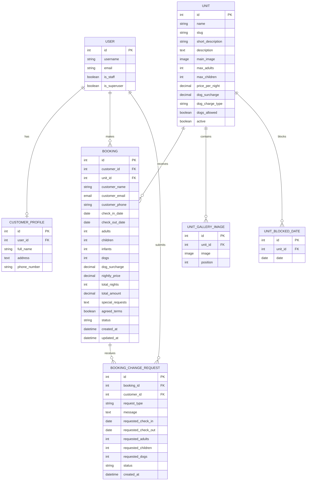

# Stay Wyld 

## Site & Developer Links:

Deployed Site: [StayWyld](https://staywyld-capstone-b19305edb31c.herokuapp.com/)

[GitHub Project Board](https://github.com/users/CEAdlin/projects/4)

Developer: Corrine Adlington ([CEAdlin](https://www.github.com/CEAdlin))

## Project Overview:

A responsive, full-stack Django web application designed to allow visitors to explore three glamping units, make enquiries, register as customers and book available accommodation for a minimum two-night stay. The website will include customer authentication, a database-driven booking and availability system, and a secure admin area where accommodation, customers and bookings can be managed. The project will demonstrate the use of HTML, CSS, JavaScript, Python, Django, Cloudinary and Heroku, following Agile development principles and MoSCoW prioritisation.

## User Stories

User stories organised by 'user'.

### Visitor Stories

| ID | User story | Priority | Board status |
| --- | --- | --- | --- |
| US01 | As a visitor, I want to view the homepage so that I can understand what Stay Wyld offers. | Must | Done |
| US02 | As a visitor, I want to view the accommodation units so that I can choose a suitable stay. | Must | Done |
| US03 | As a visitor, I want to submit an enquiry through my dashboard prior to booking. | Could | Todo |
| US04 | As a visitor, I want to view availability and prices so that I can choose suitable dates. | Must | Done |
| US05 | As a visitor, I want to view accommodation photographs before booking. | Should | Done |

### Customer Stories

| ID | User story | Priority | Board status |
| --- | --- | --- | --- |
| US06 | As a customer, I want to register for an account so that I can manage bookings. | Must | Done |
| US07 | As a customer, I want to log in securely so that I can access my account. | Must | Done |
| US08 | As a customer, I want to book an available unit so that I can reserve my stay. | Must | Done |
| US09 | As a customer, I want to see live prices for selected dates. | Must | Done |
| US10 | As a customer, I want to view my bookings and stay history. | Should | Done |
| US11 | As a customer, I want to request a booking modification or cancellation. | Should | Done |
| US12 | As a customer, I want to post a review. | Could | Won'tHave |
| US13 | As a customer, I want to edit my customer profile. | Could | Todo |
| US14 | As a customer, I want to receive booking reminder emails. | Could | Won'tHave |

### Administrator Stories

| ID | User story | Priority | Board status |
| --- | --- | --- | --- |
| US15 | As an administrator, I want to log in securely so that I can manage the website. | Must | Done |
| US16 | As an administrator, I want to add and edit accommodation units. | Must | Done |
| US17 | As an administrator, I want to view and modify bookings. | Must | Done |
| US18 | As an administrator, I want to create bookings on behalf of customers. | Must | Done |
| US19 | As an administrator, I want to enforce a minimum stay. | Must | Done |
| US20 | As an administrator, I want to manage accommodation images. | Should | Done |
| US21 | As an administrator, I want to view customer enquiries. | Could | Todo |
| US22 | As an administrator, I want to view bookings and previous stays. | Should | Done |
| US23 | As an administrator, I want a dashboard to monitor the glampsite. | Should | Done |
| US24 | As an administrator, I want to search customers by name. | Should | Done |
| US25 | As an administrator, I want each booking to have a unique ID. | Should | Done |
| US26 | As an administrator, I want to search bookings by ID. | Should | Done |
| US27 | As an administrator, I want to view booking information by accommodation unit. | Should | Done |
| US28 | As an administrator, I want to block dates by unit. | Should | Done |
| US29 | As an administrator, I want to manage unit pricing so that accommodation prices. | Should | Done |
| US30 | As an administrator, I want to view and update registered customers. | Could | Done |
| US31 | As an administrator, I want to filter bookings by date, accommodation and 'Active' status. | Could | Done |

## Wireframes

The following full-page wireframes show the planned desktop, tablet and mobile
layouts in the order a visitor, customer or administrator would normally access
the application. Each image includes the complete page flow, including lower
content sections and the footer.

### 1. `index.html`

| Full-page wireframe |
| --- |
|  |

### 2. `unit_detail.html`

| Full-page wireframe |
| --- |
|  |

### 3. `booking_create.html`

| Full-page wireframe |
| --- |
|  |

### 4. `my_bookings.html`

| Full-page wireframe |
| --- |
|  |

### 5. `booking_detail.html`

| Full-page wireframe |
| --- |
|  |

### 6. `booking_update.html`

| Full-page wireframe |
| --- |
|  |

### 7. `admin_dashboard.html`

| Full-page wireframe |
| --- |
|  |

### 8. `admin_bookings_list.html`

| Full-page wireframe |
| --- |
|  |

### 9. `admin_booking_detail.html`

| Full-page wireframe |
| --- |
|  |

### 10. `admin_customers_list.html`

| Full-page wireframe |
| --- |
|  |

### 11. `admin_customer_detail.html`

| Full-page wireframe |
| --- |
|  |

### 12. `admin_units_list.html`

| Full-page wireframe |
| --- |
|  |

### 13. `admin_unit_detail.html`

| Full-page wireframe |
| --- |
|  |

### Wireframe Summary

The wireframes were an important part of my planning process. They helped me
organise the site's information architecture, map the customer booking journey
and identify the main functions required on each page. Creating desktop, tablet
and mobile layouts also encouraged me to consider responsive behaviour before
implementation, including the way forms, booking calendars, tables and
administration controls would reflow on smaller screens.

During development, I adapted some of the original layouts as the functionality
became clearer and as usability issues were identified through testing. These
changes included refining the booking flow, separating customer and staff
workflows, improving filter controls and restructuring content for mobile
devices. The final design is therefore an informed evolution of the initial
wireframes rather than a direct copy, and better reflects the completed
application and its real user journeys.

## Design and Planning
### Purpose and Target Users

Stay Wyld is designed for visitors and customers who want to explore a small
glamping site, check availability and make a booking. A second user group is
staff, who need a practical administration area for managing units, images,
blocked dates, customers and bookings.

The main user problem is that accommodation information, availability and
booking management need to be available in one clear workflow. The design
therefore separates the public discovery journey from the authenticated
customer journey and the staff management journey.

### Layout and Design Rationale

The visual direction is inspired by woodland accommodation and combines dark
green, dark blue, muted gold and light neutral surfaces. Large accommodation
imagery establishes the setting, while structured sections and clear buttons
make booking actions easy to find.

The main layout decisions were:

- The homepage hero introduces the brand and leads into the accommodation list.
- The three units are displayed as full-width stacked rows so each unit has
	enough space for its image, description, facilities and booking actions.
- Unit detail pages separate information, gallery images and availability.
- Booking pages place date selection beside booking details on larger screens
	and stack them on smaller screens.
- Customer pages prioritise booking status, dates and next actions.
- Staff pages use denser tables, filters and management panels for repeated
	administrative tasks.

### Typography

- **Island Moments** is the primary display font used for branding and large
	headings.
- **Cormorant Garamond** is the secondary font used for body copy, labels and
	interface text.
- **Manrope** is imported as an additional interface font option.

### Colour Palette

The implemented CSS variables are:

| Variable | Value | Use |
| --- | --- | --- |
| `--colour-primary` | `#436043` | Primary green text and accents |
| `--colour-secondary` | `#759075` | Supporting green states |
| `--colour-tertiary` | `#ffffff` | Light text and surfaces |
| `--colour-accent` | `#c1bd88` | Gold borders, buttons and highlights |
| `--colour-blue` | `#28293e` | Dark panels, navigation and footer |

### UX, Accessibility and Responsive Planning

The templates use semantic headings, labelled form controls, descriptive image
alternative text, native buttons and links, and responsive CSS media queries.
The heading structure was reviewed so pages use a logical `h1`, `h2` and `h3`
sequence. The implementation also includes:

- Clear navigation and booking calls to action.
- Separate customer and staff workflows.
- Clear validation messages and user feedback.
- Keyboard-friendly native controls and visible focus styling.
- Responsive layouts without loss of core functionality.

### Responsive Planning

Responsive behaviour was considered during the planning and wireframing stages.
The layouts were designed for desktop, tablet and mobile screen sizes using CSS
media queries, Flexbox and Grid.

On the homepage, the three accommodation units remain as full-width rows rather
than being forced into narrow columns. On booking pages, the availability
calendar and booking form sit beside each other on larger screens and stack
vertically on smaller screens. Tables and administration filters are allowed to
wrap or scroll where necessary so that functionality remains usable on mobile
devices.

Responsive testing was carried out using browser developer tools and the
deployed site. The main checks included readable text, usable navigation,
accessible form controls, correctly scaled images, no unnecessary horizontal
scrolling and buttons that remain easy to use on touch screens.

### Lighthouse Evidence

Lighthouse was used to audit the deployed site across Performance,
Accessibility, Best Practices and SEO. The evidence below includes a mobile
homepage audit and a desktop unit-page audit. Scores can vary depending on
network conditions, device emulation and the page being tested.

Homepage - Mobile:

Units page - Desktop:

| Lighthouse category | Score | Notes and improvements |
| --- | --- | --- |
| Performance | 78 | The site contains image-rich accommodation content. Images were compressed and converted to WebP to reduce transfer size. Remaining opportunities include reducing render-blocking CSS and external font requests. |
| Accessibility | 97 | The remaining deduction is related to colour contrast in the availability calendar, where blocked dates use a muted grey treatment. This is documented as a future improvement while preserving the visual distinction between available, booked and blocked dates. |
| Best Practices | 100 | No Lighthouse best-practice failures were reported in the tested audit. Production settings were checked separately to ensure `DEBUG` is disabled and secrets are stored as environment variables. |
| SEO | 100 | The audit found no SEO issues in the tested pages. Page titles and meta descriptions are present. |

## Agile Methodology

Agile methodology was used to develop Stay Wyld in small, manageable feature
slices rather than attempting to build the complete application at once. The
work was planned around the needs of visitors, customers and administrators,
then refined as features were implemented and tested.

### User Stories and Acceptance Criteria

The product backlog was organised into user stories on the GitHub Project Board.
Each story described the user type, desired outcome and reason for the feature.
Acceptance criteria were used to define what successful completion looked like.
For example, the booking story required date selection, availability checking,
price calculation, the two-night minimum and successful database storage.

Stories were broken into practical development tasks, such as creating models,
views, templates, validation, permissions and tests. The full story tables are
documented earlier in this README and the detailed issue-style stories are in
`documentation/github_issues.md`.

### Kanban Board

The GitHub Project Board was used as a Kanban board. Cards were organised by
status and moved as work progressed:

Completed features were checked manually and with automated tests before being
treated as Done. The board provided a visible record of planned, active and
completed work.

Story points were not used. Work was prioritised using MoSCoW labels and user-story priority.

### MoSCoW Prioritisation

The stories were prioritised using MoSCoW:

- **Must:** Essential booking, account and administration functionality.
- **Should:** Important improvements that support the main workflows.
- **Could:** Useful extensions that are outside the minimum viable product.
- **Won't:** Outside the scope of this project, but could be useful additions further down the line.

This prioritisation kept the core booking and authentication journeys ahead of
optional features such as reviews, reminder emails and online payments.

### Iteration and Review

Development changed in response to testing, browser behaviour and deployment
feedback. Iterative improvements included:

- Refining responsive layouts for mobile, tablet and desktop.
- Correcting booking date validation and allowing check-in on checkout dates.
- Adding blocked-date availability management.
- Adding booking ID, unit, date and status filters.
- Adding customer-name search and reset controls.
- Moving uploaded media to Cloudinary for reliable production storage.
- Improving heading hierarchy, alternative text and meta descriptions.
- Removing invalid CDN references identified through Lighthouse.

### Agile Reflection

The board and user stories helped keep the work visible and prioritised. Testing
each feature as it was completed made it easier to identify issues early and
adapt the design without losing sight of the main booking purpose. Features
that were not required for the first version were kept as future scope rather
than delaying the core release.

# Stay Wyld Database Diagram

## Relationship Notes

 Each registered customer has one `CustomerProfile` linked to exactly one Django `User`, enforced by the one-to-one relationship. 
 Staff and superuser accounts use Django's built-in `User` account for administration and are intentionally exempt from the customer-specific profile. `CustomerProfile.user_id` is therefore unique. 
 `Unit.slug` is also unique in Django, although those uniqueness markers are omitted from the Mermaid field syntax for parser compatibility.
 An authenticated customer can have many bookings. An administrator-created booking may have no linked user because the customer's name, email and phone are stored directly on the booking.
 A unit can have many bookings, gallery images and blocked dates.
 A booking can have multiple modification or cancellation requests, each submitted by a customer user, only one request per unit can be open at any one time.
 The unique unit/date constraint prevents the same date being blocked more than
 once for a particular unit.

## Workflow Notes

- A customer booking is initially stored with a `PENDING` status. Staff can
    review it and change the status to `CONFIRMED`, `CANCELLED` or `COMPLETED`.
- Customer modification and cancellation requests are stored separately in
    `BookingChangeRequest`. Staff approval is represented by the request status
    changing from `OPEN` to `APPROVED` or the internal `REJECTED` value, which is
    displayed to users as **Declined**.
- A booking is not considered available only because it is pending. The booking
    availability logic checks date overlap and ignores cancelled bookings.
- Staff can create `UnitBlockedDate` records for maintenance or private use.
    Blocked nights are displayed as unavailable and rejected by the booking
    validation logic.
- A following booking can check in on the previous booking's checkout date,
    because the checkout date is treated as the exclusive end of the stay.

## Features

The tables below summarise the main implemented features. Wireframe thumbnails
are clickable and open the full-page design evidence. 

### Navigation (including login and registration)

| Feature | Description | Screenshot |
| --- | --- | --- |
| Public navigation | Main navigation bar with top, user-nav-bar showing login status |  |
| Login and registration | Customers can register, log in and log out. Navigation changes according to authentication state and role. |  |

### Security

| Feature | Description | Screenshot |
| --- | --- | --- |
| Defensive programming | Forms validate required values, dates, guest numbers, passwords and booking rules. Invalid input receives clear feedback. |       |
| Authentication and authorisation | If not logged in - directed to login-page to access user/super-user restricted content. If user is logged in and attempts to access super-user restricted content request will be ignored and they will be re-drected to index.html. |  |

### Homepage

| Feature | Description | Screenshot |
| --- | --- | --- |
| Brand introduction | Hero content introduces Stay Wyld and provides clear booking calls to action. |  |
| Unit rows | Three accommodation units are shown as full-width stacked rows with images, descriptions, facilities and booking links. |  |
| About and gallery | The homepage continues with the About section, photo gallery and footer contact details. |  |

### Unit Details

| Feature | Description | Screenshot |
| --- | --- | --- |
| Unit information | Displays unit name, description, facilities, capacity, pricing and main image. |     |
| Gallery | Displays additional Cloudinary-backed gallery images. |  |
| Booking call to action | Links the visitor to the booking flow for the selected unit. |  |

### Create A Booking

| Feature | Description | Screenshot |
| --- | --- | --- |
| Availability calendar | Shows booked and blocked dates and lets customers select valid dates. |  |
| Booking validation | Enforces the two-night minimum, prevents overlaps and allows check-in on an existing checkout date. | Screenshot to add |
| Pricing and confirmation | Calculates nights, nightly price and dog surcharge before confirmation. |  |

### Update Booking Request

| Feature | Description | Screenshot |
| --- | --- | --- |
| Request form | Customers can submit requested date, guest and dog changes for staff approval. |  |
| Request status | The customer can see that a change request is awaiting staff action. | Screenshot to add |

### Delete Booking Request

| Feature | Description | Screenshot |
| --- | --- | --- |
| Cancellation request | Customers submit a cancellation request rather than directly deleting protected booking data. |  |
| Staff decision | Staff can approve or decline the request, with the user-facing status displayed as Declined when appropriate. | Screenshot to add |

### Admin Dashboard

| Feature | Description | Screenshot |
| --- | --- | --- |
| Staff overview | Provides navigation and summary access to units, customers, bookings and availability management. |  |

### Admin Booking List

| Feature | Description | Screenshot |
| --- | --- | --- |
| Booking table | Shows customer, unit, dates, status, request status and actions. |  |
| Filters | Filters by current/upcoming, past, current, upcoming, unit, date range and exact booking ID. |  |
| Clear control | Resets all booking filters and returns to the default current/upcoming view. | Screenshot to add |

### Admin Detail (including requests and modify)

| Feature | Description | Screenshot |
| --- | --- | --- |
| Booking details | Staff can view customer contact details, dates, guests, price and status. |  |
| Modify booking | Staff can update booking dates, guests, dogs and status. |  |
| Change requests | Staff can review open modification or cancellation requests and approve or decline them. | Screenshot to add |

### Customer List

| Feature | Description | Screenshot |
| --- | --- | --- |
| Customer records | Superusers can view registered customer names, email, phone, booking count and active-booking state. |  |
| Search and sorting | Customers can be sorted A-Z or by active booking and searched by partial name with reset control. |  |

### Customer Detail (including modify and delete)

| Feature | Description | Screenshot |
| --- | --- | --- |
| Customer profile | Superusers can view and update customer name, email, address and phone details. |  |
| Customer bookings | Displays bookings associated with the selected customer. |  |
| Protected account actions | Customer deletion and sensitive actions require authorised staff access and confirmation. | Screenshot to add |

### Unit List

| Feature | Description | Screenshot |
| --- | --- | --- |
| Unit overview | Staff can view the available unit records and access each unit's management page. |  |

### Unit Detail (including update)

| Feature | Description | Screenshot |
| --- | --- | --- |
| Unit editing | Staff can update name, descriptions, capacity, pricing, dog settings and active status. |  |
| Media management | Staff can upload, order and delete main and gallery images stored through Cloudinary. |  |
| Blocked availability | Staff can select dates and mark them unavailable or available. Booked dates cannot be changed. |  |

---
# =ػ� Technologies Used

<!-- TODO:

Keep this list updated as you build the project. Only list technologies you actually use.

-->

### Frontend

- **HTML5**   Semantic structure and content.

- **CSS3**   Styling, layout and responsive design.

- **JavaScript**   Client-side interaction and validation.

### Backend

- **Python**   Backend programming and booking/business logic.

- **Django**   Web framework, routing, templates, forms, authentication and administration.

- **Django ORM**   Database interaction and model relationships.

### Database

<!-- TODO:

Add the actual database technology you use.

-->

- **PostgreSQL**   Production relational database.

### Media

- **Cloudinary**   Cloud-based storage and optimisation of accommodation images and other media.

### Deployment

- **Heroku**   Hosting and deployment of the Django application.

- **Git & GitHub**   Version control and source-code management.

### Development Tools

<!-- TODO:

Add any tools you actually use, for example:

-->

- Visual Studio Code

- GitHub

- Chrome DevTools

- Figma / Balsamiq / Canva / other design tool

- Google Lighthouse

---

# >��� Testing

Please see TESTING.md 

## Deployment

This website is deployed to Heroku from a GitHub repository, the following steps were taken:

#### Creating Repository on GitHub

- First make sure you are signed into [Github](https://github.com/) and go to the code institutes template, which can be found [here](https://github.com/Code-Institute-Org/gitpod-full-template).

- Then click on **use this template** and select **Create a new repository** from the drop-down. Enter the name for the repository and click **Create repository from template**.

- Once the repository was created, I clicked the green **gitpod** button to create a workspace in gitpod so that I could write the code for the site.

#### Creating an app on Heroku

- After creating the repository on GitHub, head over to [heroku](https://www.heroku.com/) and sign in.

- On the home page, click **New** and **Create new app** from the drop down.

- Give the app a name(this must be unique) and select a **region** I chose **Europe** as I am in Europe, Then click **Create app**.

#### Create a database 

- Log into [CIdatabase maker](https://www.heroku.com/](https://dbs.ci-dbs.net/))

- add your email address in input field and submit the form

- open database link in your email

- paste dabase URL in your DATABASE_URL variable in env.py file and in Heroku config vars

#### Deploying to Heroku.

- Head back over to [heroku](https://www.heroku.com/) and click on your **app** and then go to the **Settings tab**

- On the **settings page** scroll down to the **config vars** section and enter the **DATABASE_URL** which you will set equal to the elephantSQL URL, create **Secret key** this can be anything,

**CLOUDINARY_URL** this will be set to your cloudinary url and finally **Port** which will be set to 8000.

- Then scroll to the top and go to the **deploy tab** and go down to the **Deployment method** section and select **Github** and then sign into your account.

- Below that in the **search for a repository to connect to** search box enter the name of your repository that you created on **GitHub** and click **connect**

- Once it has been connected scroll down to the **Manual Deploy** and click **Deploy branch** when it has deployed you will see a **view app** button below and this will bring you to your newly deployed app.

- Please note that when deploying manually you will have to deploy after each change you make to your repository.

## >�� AI Usage

AI tools were used throughout this project to support:

- Drafting documentation sections  

- Structuring Agile artefacts such as user stories and backlog items  

- Generating boilerplate code snippets  

- Refining written content for clarity and consistency  

- Troubleshooting layout and styling issues  

- Improving readability and organisation of the README and supporting documents  

All AI generated content was manually reviewed, edited, and validated to ensure accuracy and alignment with project requirements.  

AI was used as a **supporting tool**, not a replacement for development, decision making, or problem solving.

---

## =�L� Credits

This project was made possible with the help of the following resources:

- **Django Documentation**   backend framework guidance  

- **Bootstrap Documentation**   styling and responsive layout support  

- **Cloudinary Documentation**   media storage configuration  

- **Heroku Deployment Guides**   hosting and deployment instructions  

- **Course Tutors & Support Materials**   project structure, assessment criteria, and technical support  

- **Copilot**   assistance with documentation, planning, debugging, and content refinement  

Special thanks to everyone who contributed feedback during development and testing.

---

## =��� Project Summary

This project delivers a fully functional glampsite booking system built using Django and modern web technologies.  

Key achievements include:

- Full CRUD functionality across accommodation, bookings, and customer profiles  

- Responsive, mobile friendly frontend design  

- Secure authentication and admin management  

- Cloud based media storage using Cloudinary  

- PostgreSQL database integration for deployment  

- Live deployment on Heroku  

- Comprehensive Agile documentation including backlog, user stories, and sprint planning  

The project demonstrates strong understanding of:

- Full stack development  

- Agile methodologies  

- UX/UI planning and responsive design  

- Testing and debugging  

- Cloud deployment workflows  

- Version control and repository management  

---

## >��� Final Reflection

This project has been a significant learning experience, combining frontend design, backend logic, database management, and deployment.

### What Went Well

- Agile planning helped maintain structure and momentum throughout development.  

- Django s model view template architecture strengthened backend understanding.  

- Implementing CRUD functionality improved confidence with database interactions.  

- Deployment challenges built resilience and problem solving skills.  

- Testing highlighted the importance of validating user flows early and often.

### Challenges Faced

- Managing media storage and responsive images required careful configuration.  

- Ensuring consistent styling across devices took multiple iterations.  

- Debugging deployment issues on Heroku was time consuming but rewarding.

### Key Takeaways

- Planning and documentation are just as important as coding.  

- Small, iterative improvements lead to a polished final product.  

- Real world deployment teaches lessons that local development cannot.  

- Combining creativity with technical skill results in a richer user experience.

Overall, this project represents a major step forward in full stack development skills and real world application building.  

It has strengthened confidence in both frontend and backend development and provided a solid foundation for future projects.

---

