# 🧪 Testing

Testing was carried out throughout development to ensure that the application was functional, responsive, accessible and secure.

Testing included:

- User story testing
- Feature testing
- Form validation
- Booking validation
- Authentication testing
- Authorisation testing
- Responsive testing
- Browser compatibility testing
- HTML validation
- CSS validation
- JavaScript validation
- Python/Django checks
- Lighthouse testing
- Manual bug testing

---

# Manual Testing – User Stories

Each user story was manually tested to confirm that the implemented functionality meets the acceptance criteria and provides the intended experience for visitors, customers and administrators.

## Visitor User Stories

| ID | User Type | User Story | Test | Expected Result | Screenshot |
|---|---|---|---|---|---|
| US01 | Visitor | As a visitor, I want to view the homepage so that I can understand what the glampsite offers. | Navigate to the website homepage. | The homepage loads successfully and clearly presents the glampsite, accommodation and key information. |  |
| US02 | Visitor | As a visitor, I want to view the three accommodation units so that I can decide which accommodation is suitable for me. | Navigate to the accommodation section and view each unit. | All three accommodation units are displayed with relevant information. | 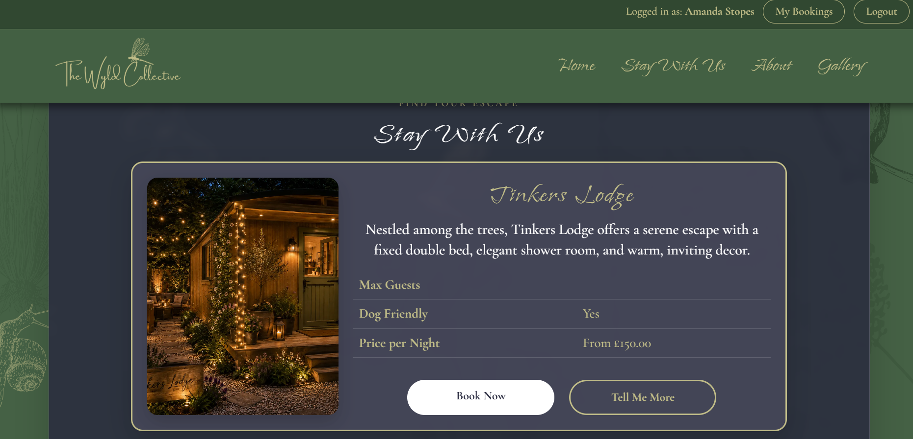 |
| US03 | Visitor | As a visitor, I want to submit an enquiry so that I can ask questions before booking. | Complete and submit the enquiry form using valid information. | The enquiry is submitted successfully and confirmation is provided to the visitor. | N/A - feature not implemented |
| US04 | Visitor | As a visitor, I want to see a calendar showing availability and nightly prices. | Open the availability calendar and select different dates. | The calendar displays available and unavailable dates and the correct nightly prices. | 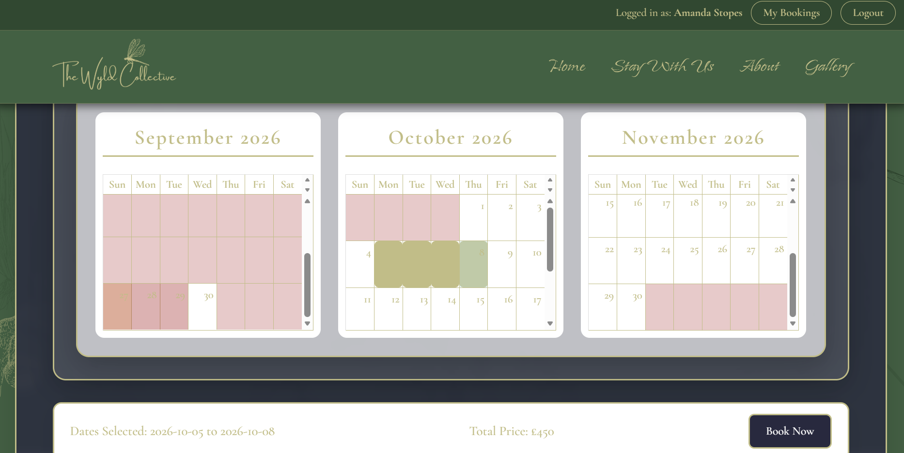 |
| US05 | Visitor | As a visitor, I want to view accommodation photographs so that I can understand what the units and site look like. | Open the accommodation photographs/gallery. | Relevant photographs are displayed correctly and can be viewed clearly. |  |

## Customer User Stories

| ID | User Type | User Story | Test | Expected Result | Screenshot |
|---|---|---|---|---|---|
| US06 | Customer | As a customer, I want to register for an account so that I can book online. | Complete the registration form using valid customer details. | A customer account is created successfully and the customer can access the booking functionality. |  |
| US07 | Customer | As a registered customer, I want to log in securely so that I can access my account and see my booking/s. | Enter valid login credentials and submit the login form. | The customer is securely logged in and can access their account and bookings. |  |
| US08 | Customer | As a customer, I want to book an available unit so that I can arrange my stay. | Select an available unit and valid dates and complete the booking process. | The booking is successfully created and stored against the customer's account. | 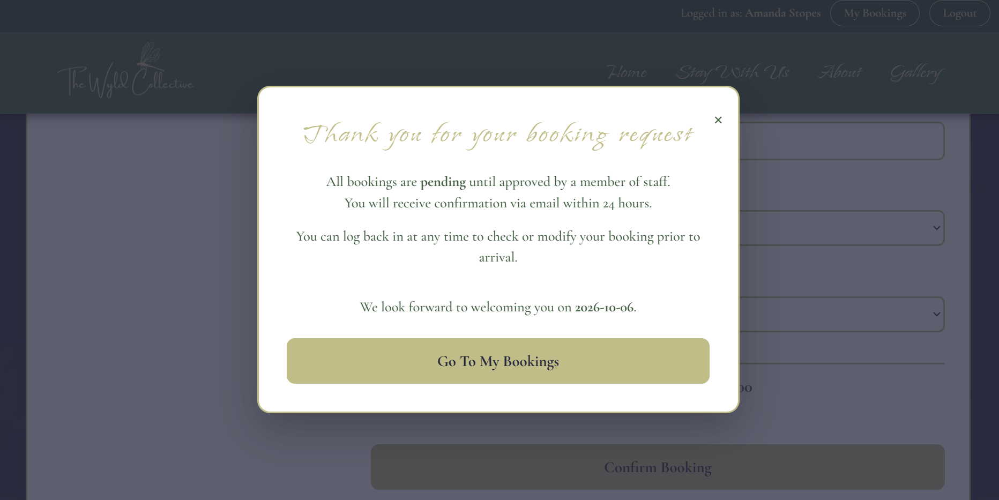 |
| US09 | Customer | As a customer, I want to see live prices for my selected dates. | Select different accommodation and booking dates. | The total price updates correctly according to the selected dates and nightly prices. |  |
| US10 | Customer | As a customer, I want to view my bookings so that I can check my upcoming stays along with balances paid and outstanding. | Log in and open the customer's bookings/account page. | The customer's bookings are displayed with relevant stay dates, accommodation and payment balance information. |  |
| US11 | Customer | As a customer, I want to be able to request to modify or cancel a booking online. | Open an existing booking and submit a modification or cancellation request. | The request is submitted successfully and the customer receives confirmation. | 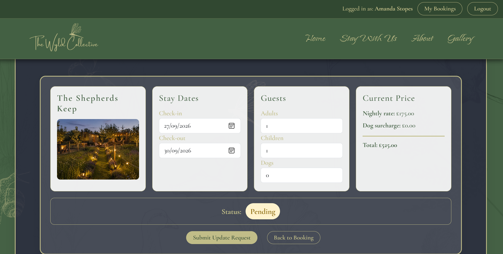  |
| US12 | Customer | As a customer, I would like to post a review of my glamping unit along with pictures. | Submit a review with text and an image after a stay. | The review and photograph are submitted successfully and displayed appropriately. | N/A - feature not implemented |
| US13 | Customer | As a customer, I want to be able to edit my profile details so that my information remains up to date. | Log in and edit the customer's profile information. | The updated profile information is saved successfully and displayed correctly. | N/A - feature not implemented |
| US14 | Customer | As a customer, I would like to receive reminder emails before my stay with any helpful information. | Create an upcoming booking and trigger/test the booking reminder process. | A reminder email is sent to the customer before their stay containing relevant information. | N/A - feature not implemented |

## Administrator User Stories

| ID | User Type | User Story | Test | Expected Result | Screenshot |
|---|---|---|---|---|---|
| US15 | Administrator | As an administrator, I want to securely log in so that I can manage the website. | Access the administrator login and enter valid administrator credentials. | The administrator is securely logged in and can access the administration functionality. |  |
| US16 | Administrator | As an administrator, I want to edit accommodation units so that the website information remains up to date. | Edit an existing unit; description, occupancy, dog-friendly & images. | Accommodation information is successfully created and updated, and changes appear on the website. |  |
| US17 | Administrator | As an administrator, I want to view and modify bookings so that I can manage reservations. | Log in as an administrator and view/edit an existing booking. | The administrator can view and successfully modify booking information. |  |
| US18 | Administrator | As an administrator, I want to create a booking on behalf of a customer so that I can handle bookings made by phone or in person. | Create a booking through the administration area. | A booking is successfully created and linked to the correct customer and accommodation. |  |
| US19 | Administrator | As an administrator, I want to set a minimum stay for bookings. | Configure the minimum stay and attempt bookings below and above the minimum. | Bookings below the minimum stay are prevented and valid bookings are accepted. | 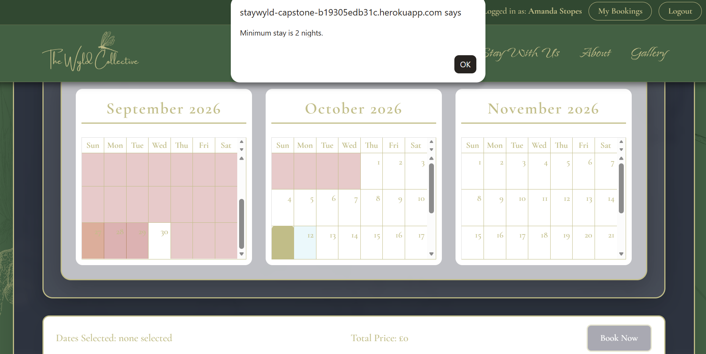 |
| US20 | Administrator | As an administrator, I want to manage accommodation images so that website photographs can be updated without changing the code. | Add, edit or remove an accommodation image through the administration area. | Images can be successfully managed and changes are reflected on the website. |  |
| US21 | Administrator | As an administrator, I want to view customer enquiries so that I can respond to potential customers. | Log in to the administration area and open the enquiries section. | Customer enquiries are displayed with the relevant customer and enquiry information. | N/A - feature not implemented |
| US22 | Administrator | As an administrator, I want to view a list of all bookings so that I can monitor upcoming and previous stays. | Open the bookings section within the administration area. | All relevant bookings are displayed with accommodation, customer and date information. | 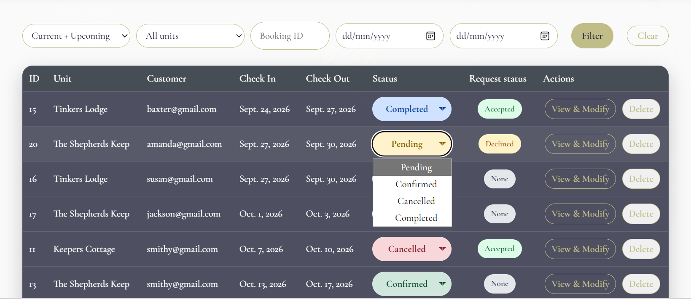 |
| US23 | Administrator | As an administrator, I want to access a dashboard showing units, upcoming bookings, registered customers and bookings per unit this month so that I can quickly monitor the glampsite. | Log in to the administration area and open the dashboard. | The dashboard displays accurate information for units, upcoming bookings, registered customers, unread enquiries, unavailable units and bookings per unit for the current month. |  [US23 Dashboard Test](documentation\features\admin_bookings_list.png)|
| US24 | Administrator | As an administrator, I want to be able to search customers by name so that I can quickly find customer information. | Enter a customer's name into the customer search function. | Customers matching the search criteria are displayed. | 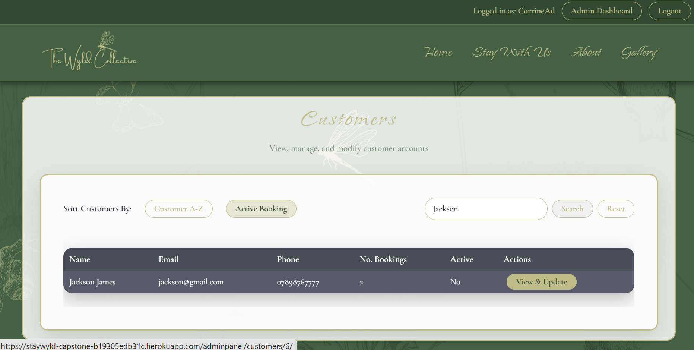 |
| US25 | Administrator | As an administrator, I want each booking to automatically be assigned a unique booking reference number so that bookings can be easily identified. | Create a new booking and view the booking details. | A unique booking reference number is automatically generated and assigned to the booking in the form of an ID. |  |
| US26 | Administrator | As an administrator, I want to be able to search bookings by booking ID so that I can quickly find a specific reservation. | Enter a valid booking reference ID into the booking search function. | The booking matching the reference ID number is displayed. | 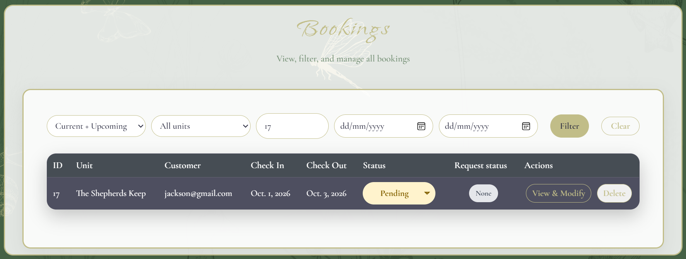 |
| US27 | Administrator | As an administrator, I want to be able to see booking statistics by unit so that I can understand booking trends. | Open the booking statistics section and The number of bookings is displayed. | A list of bookings per unit is displayed: past, present and future. |  |
| US28 | Administrator | As an administrator, I want to be able to temporarily block out dates by unit for maintenance or private use so that unavailable dates cannot be booked. | Block selected dates for a specific accommodation unit and attempt to make a booking for those dates. | The selected dates are shown as unavailable and customers cannot book the unit during the blocked period. | 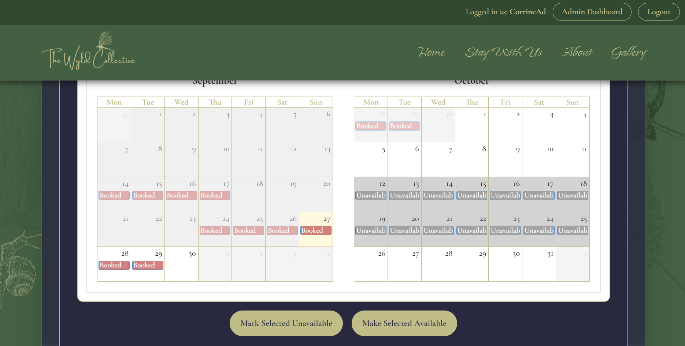 |
| US29 | Administrator | As an administrator, I want to manage unit pricing so that accommodation prices remain accurate throughout the year. | Configure different prices for units and date periods. | The correct price is displayed for the selected unit and dates. |  |
| US30 | Administrator | As an administrator, I want to view registered customers so that I can access and manage customer accounts and contact information. | Open the customer management section. | A list of registered customers is displayed with relevant account and contact information. | 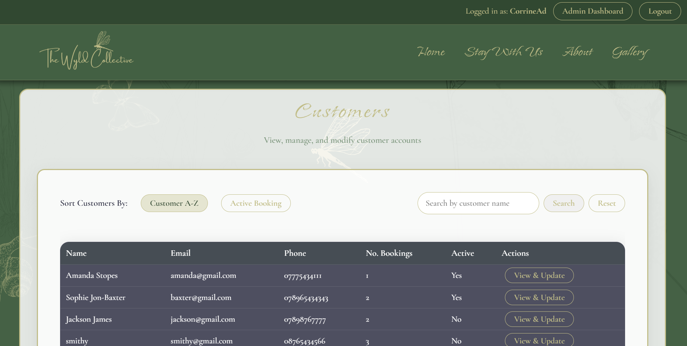 |
| US31 | Administrator | As an administrator, I want to filter bookings by date, accommodation and status so that I can quickly find specific bookings. | Apply different booking filters. | The booking list updates to display only bookings matching the selected filters. | 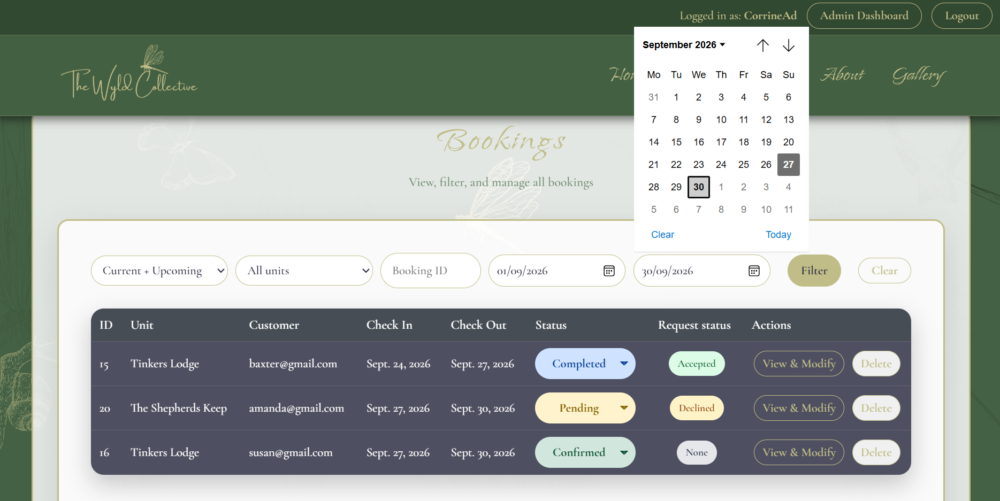 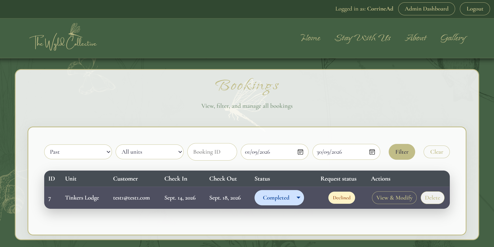 |

# Manual Testing – Features

Each major feature was manually tested to ensure that it works as intended across different user roles, devices and scenarios.

| Feature | Test | Expected Result | Actual Result | Screenshot | Pass/Fail |
|---|---|---|---|---|---|
| Navigation | Click each navigation link from the homepage. | Each link directs the user to the correct page or section. | Each navigation link directed to the correct page or section. |  | Pass |
| Responsive Navigation | View the navigation on desktop, tablet and mobile screen sizes. | Navigation remains usable and displays correctly at different screen sizes. | Navigation remained usable and displayed correctly across the tested screen sizes. |  | Pass |
| Homepage | Load the homepage. | Homepage loads successfully with all content, images and navigation displayed correctly. | The homepage loaded successfully with its content, images and navigation displayed correctly. |  | Pass |
| Accommodation Listings | Open the accommodation section. | All three accommodation units are displayed with correct information. | All three accommodation units were displayed with the correct information. |  | Pass |
| Accommodation Details | Select an individual accommodation unit. | The correct accommodation details, facilities, pricing and photographs are displayed. | The selected unit displayed the correct details, facilities, pricing and photographs. | 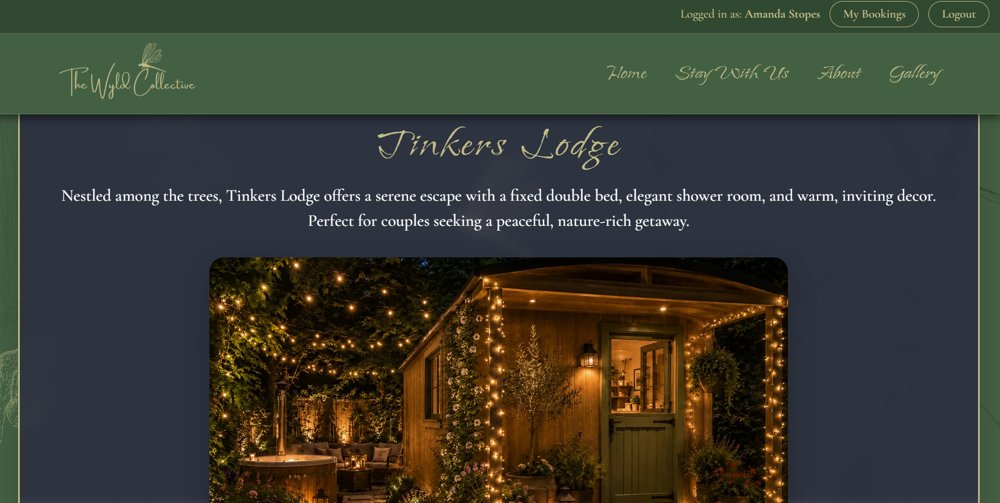 | Pass |
| Accommodation Images | Open accommodation photographs/gallery. | Images load correctly and are displayed clearly. | The accommodation images loaded correctly and were displayed clearly. |  | Pass |
| Availability Calendar | Open the availability calendar. | Calendar displays available and unavailable dates correctly. | The calendar displayed available and unavailable dates correctly. |  | Pass |
| Availability Calendar | Select dates containing an existing booking. | Dates that are already booked are shown as unavailable. | Existing booking dates were shown as unavailable. | 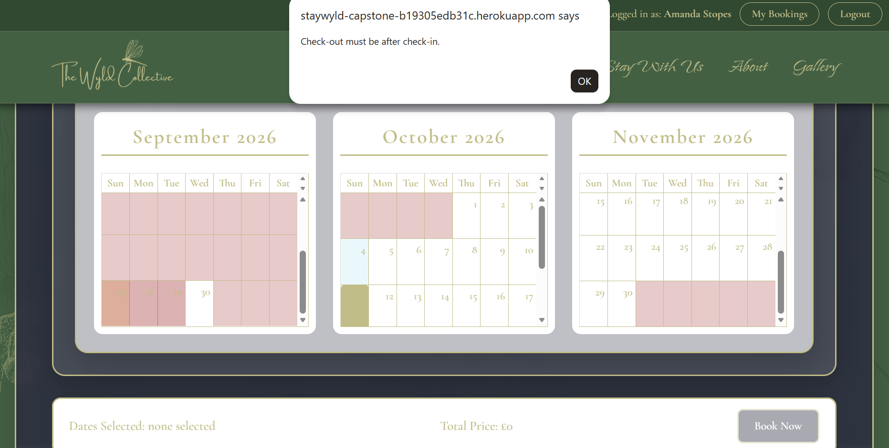 | Pass |
| Availability Calendar | Select dates outside existing bookings. | Available dates can be selected for booking. | Dates outside existing bookings could be selected for booking. | 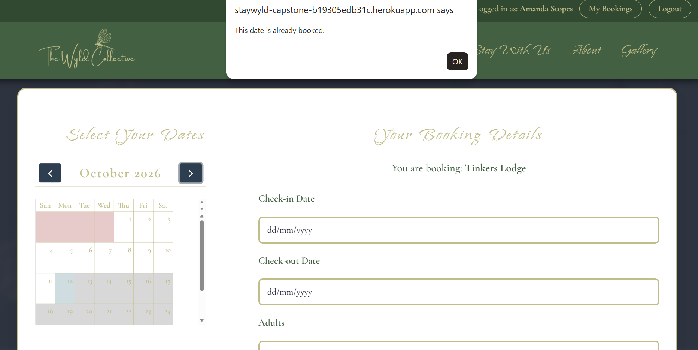 | Pass |
| Live Pricing | Select different accommodation and dates. | The displayed price updates correctly according to the selected accommodation and dates. | The displayed price updated correctly for the selected accommodation and dates. |  | Pass |
| Minimum Stay | Attempt to book fewer nights than the configured minimum stay. | The system prevents the booking and displays an appropriate message. | The system prevented the booking and displayed the minimum-stay message. |  | Pass |
| Minimum Stay | Attempt to book the minimum number of nights. | The booking can proceed successfully. | A booking meeting the minimum stay could proceed successfully. |  | Pass |
| Booking Validation | Select a departure date before the arrival date. | The system prevents an invalid booking and displays an appropriate error message. | The system prevented the invalid date selection and displayed an appropriate message. |  | Pass |
| Booking Validation | Attempt to book dates that overlap an existing booking. | The system prevents the overlapping booking. | The system prevented the overlapping booking. |  | Pass |
| Customer Registration | Register using valid customer information. | A new customer account is successfully created. | A new customer account was created successfully. |  | Pass |
| Customer Registration | Attempt to register with invalid or incomplete information. | Validation messages are displayed and the account is not created until valid information is provided. | Validation messages were displayed and the account was not created until valid information was provided. |  | Pass |
| Customer Login | Log in using valid customer credentials. | Customer is successfully authenticated and redirected to the appropriate page. | The customer was authenticated successfully and redirected to the appropriate page. |  | Pass |
| Customer Login | Attempt to log in using incorrect credentials. | Login fails and an appropriate error message is displayed. | Login failed and an appropriate error message was displayed. |  | Pass |
| Customer Logout | Select the logout option while logged in. | Customer is securely logged out and redirected appropriately. | The customer was logged out securely and redirected appropriately. |  | Pass |
| Customer Bookings | Log in and open the customer's bookings. | Only the logged-in customer's bookings are displayed. | Only the logged-in customer's bookings were displayed. |  | Pass |
| Booking Reference | Create a new booking. | A unique booking reference ID is automatically generated and displayed. | A unique booking reference was generated and displayed. | 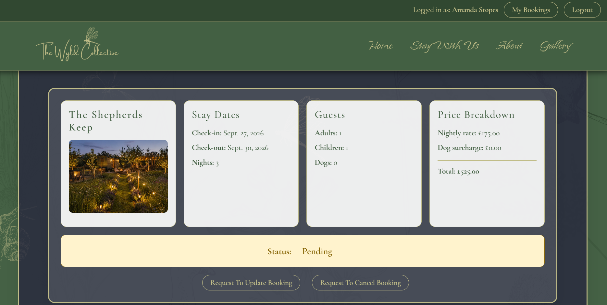 | Pass |
| Booking Confirmation | Complete a booking successfully. | Confirmation is displayed with booking details, dates, accommodation and booking reference. | Confirmation displayed the booking details, dates, accommodation and booking reference. |  | Pass |
| Profile Editing | Edit customer profile information. | Updated information is saved and displayed correctly. | Updated customer information was saved and displayed correctly. |  | Pass |
| Booking Modification Request | Submit a request to modify an existing booking. | The modification request is submitted successfully and confirmation is provided. | The modification request was submitted successfully and confirmation was provided. |  | Pass |
| Booking Cancellation Request | Submit a request to cancel an existing booking. | The cancellation request is submitted successfully and confirmation is provided. | The cancellation request was submitted successfully and confirmation was provided. |  | Pass |
| Admin Login | Log in using valid administrator credentials. | Administrator is authenticated and can access administrative functionality. | The administrator was authenticated and could access the administrative functionality. |  | Pass |
| Admin Access Control | Attempt to access administrator functionality as a normal customer or visitor. | Unauthorised users are prevented from accessing restricted functionality. | Unauthorised users were prevented from accessing restricted functionality. |  | Pass |
| Admin Dashboard | Open the administrator dashboard. | Dashboard displays units, upcoming bookings, registered customers, unread enquiries, unavailable units and bookings per unit this month. | The dashboard displayed the unit, booking, customer and availability information. |  | Pass |
| Edit Accommodation | Edit an existing accommodation unit. | Changes are saved and displayed correctly on the website. | Accommodation changes were saved and displayed correctly on the website. |  | Pass |
| Manage Images | Add, edit or remove accommodation images through the administration area. | Images are successfully managed and website content updates accordingly. | Accommodation images were managed successfully and the website content updated accordingly. |  | Pass |
| View Bookings | Open the administrator booking list. | Administrator can view relevant customer, accommodation, date and booking information. | The administrator could view the relevant booking information. |  | Pass |
| Modify Bookings | Edit an existing booking as an administrator. | Booking information is successfully updated. | Booking information was updated successfully. |  | Pass |
| Create Admin Booking | Create a booking on behalf of a customer. | Booking is successfully created and linked to the correct customer and accommodation. | The booking was created successfully and linked to the correct customer and accommodation. |  | Pass |
| Customer Search | Search for a customer using their name. | Matching customers are displayed. | Customers matching the searched name were displayed. |  | Pass |
| Booking Search | Search for a booking using its booking reference ID. | The matching booking is displayed. | The booking matching the reference ID was displayed. |  | Pass |
| Booking Filtering | Filter bookings by date. | Only bookings matching the selected date criteria are displayed. | Only bookings matching the selected date criteria were displayed. |  | Pass |
| Booking Filtering | Filter bookings by accommodation. | Only bookings for the selected accommodation are displayed. | Only bookings for the selected accommodation were displayed. | 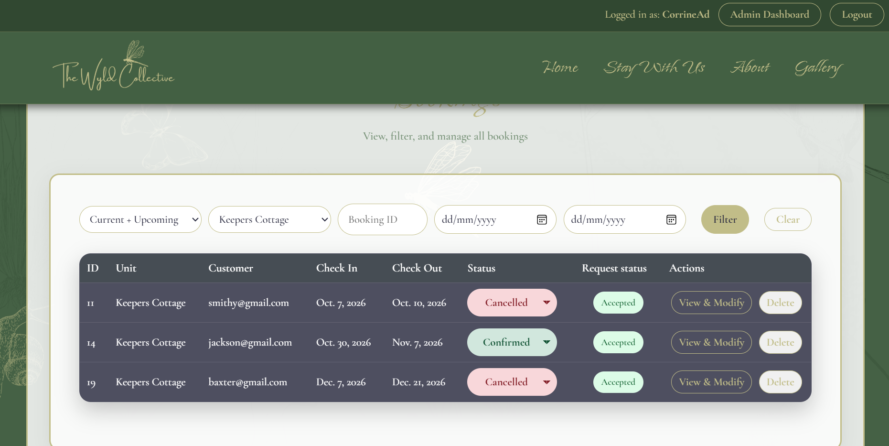 | Pass |
| Booking Filtering | Filter bookings by status. | Only bookings matching the selected status are displayed. | Only bookings matching the selected status were displayed. |  | Pass |
| Booking Statistics | Open booking statistics by accommodation unit. | Accurate booking statistics are displayed for each unit. | Accurate booking statistics were displayed for each accommodation unit. |  | Pass |
| Blocked Dates | Block dates for a specific accommodation for maintenance or private use. | Selected dates become unavailable for customer bookings. | Selected dates became unavailable for customer bookings. |  | Pass |
| Responsive Design | Test the website at desktop, tablet and mobile widths. | Website remains functional, readable and visually consistent at different screen sizes. | The website remained functional, readable and visually consistent at the tested widths. |  | Pass |
| Error Handling | Trigger common validation and booking errors. | User receives clear and understandable error messages. | Clear and understandable error messages were displayed. |  | Pass |
| 404 Error Page | Navigate to a non-existent page. | A custom 404 page is displayed instead of an unhandled server error. | The custom 404 page was displayed instead of an unhandled server error. |  | Pass |

---

# 🔦 Lighthouse

Google Lighthouse was used to assess the website's performance, accessibility, best practices and SEO.

Testing was carried out on the deployed website.

### Lighthouse Results

| Category | Score | Notes |
|---|---|---|
| Performance | TODO | TODO |
| Accessibility | TODO | TODO |
| Best Practices | TODO | TODO |
| SEO | TODO | TODO |

### Lighthouse Improvements

Any issues identified through Lighthouse testing were reviewed and improvements were made where appropriate.

Examples may include:

- Optimising image sizes.
- Improving image alt text.
- Improving colour contrast.
- Improving page structure.
- Improving heading hierarchy.
- Removing unnecessary code.
- Improving page loading performance.

---

# 🌐 Browser Compatibility

The website was tested using multiple modern browsers to ensure consistent functionality.

| Browser | Desktop | Mobile | Result |
|---|---|---|---|
| Google Chrome | Tested | Tested | TODO |
| Microsoft Edge | Tested | Tested | TODO |
| Mozilla Firefox | Tested | Tested | TODO |
| Safari | TODO | TODO | TODO |

### Browser Testing Evidence

---

# 📱 Responsiveness

The website was designed using a responsive, mobile-first approach.

Testing was carried out at different screen sizes to ensure:

- Content remains readable.
- Navigation remains usable.
- Images scale correctly.
- Forms remain accessible.
- Buttons remain usable.
- No horizontal scrolling occurs.
- Layouts adapt appropriately.

### Desktop

### Tablet

### Mobile

---

# ✅ Code Validation

## HTML Validation

The website was tested using the W3C HTML Validator.

### Result

TODO – Add validation result and describe any issues found and resolved.

---

## CSS Validation

The website was tested using the W3C CSS Validator.

### Result

TODO – Add validation result and describe any issues found and resolved.

---

## JavaScript Validation

JavaScript was tested using an appropriate JavaScript validation or linting tool.

### Result

TODO – Add validation result.

---

## Python / Django Validation

Django's built-in project checks were used to identify configuration and code issues.

Example:

python manage.py check

## 🐞 Bugs

Below is a table outlining known and resolved bugs identified during development and testing.

| Bug ID | Bug Description | Cause | Solution | Unresolved Bug Screenshot | Resolved Bug Screenshot | Status |
|--------|------------------|--------|-----------|-----------------------------|----------------------------|---------|
| 001 | Accommodation images occasionally fail to load on mobile | Slow Cloudinary response / missing responsive breakpoints | Added responsive image sizes and lazy loading | *(Insert screenshot)* | *(Insert screenshot)* | Resolved |
| 002 | Booking form allowed stays under two nights | Missing validation logic in booking model | Added server-side validation enforcing minimum stay | *(Insert screenshot)* | *(Insert screenshot)* | Resolved |
| 003 | Navigation links break on small screens | CSS media query conflict | Updated breakpoints and improved mobile nav styling | *(Insert screenshot)* | *(Insert screenshot)* | Resolved |
| 004 | Form validation messages not displaying in Safari | Browser-specific form behaviour | Added custom JS validation messages | *(Insert screenshot)* | *(Insert screenshot)* | Resolved |
| 005 | Occasional slow loading on accommodation list page | Large image payloads | Enabled Cloudinary auto‑compression and caching | *(Insert screenshot)* | *(Insert screenshot)* | Partially Resolved |