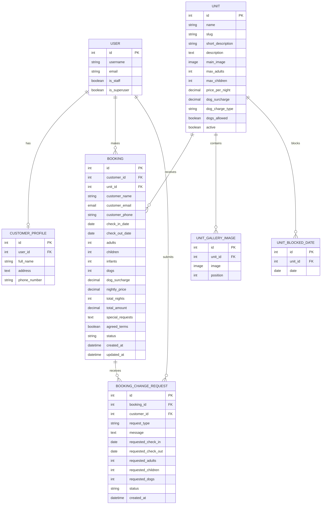

# Stay Wyld Database Diagram

This Mermaid ERD reflects the current Django models and relationships. Django's
built-in `User` model is shown alongside the project models.

## Relationship Notes

- A customer profile belongs to one Django user; a user may have no profile.
    The one-to-one Django field makes `user_id` unique.
- `Unit.slug` is unique in Django even though the Mermaid field is shown as a
    normal attribute for parser compatibility.
- A customer can create many bookings.
- A unit can have many bookings, gallery images and blocked dates.
- A booking can have multiple modification or cancellation requests.
- The unit/date uniqueness constraint prevents duplicate blocked dates for the
  same unit.
