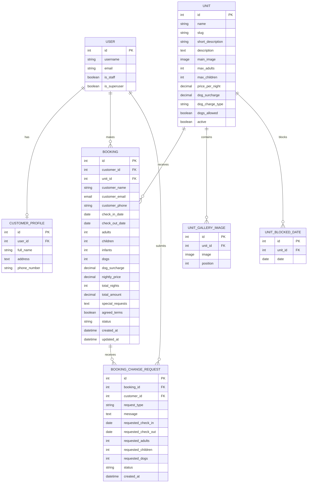

# Stay Wyld Database Diagram

This Mermaid ERD reflects the current Django models and relationships. Django's
built-in `User` model is shown alongside the project models.

## Relationship Notes

 Each registered customer has one `CustomerProfile` linked to exactly one
 Django `User`, enforced by the one-to-one relationship. Staff and superuser
 accounts use Django's built-in `User` account for administration and are
 intentionally exempt from the customer-specific profile.
 `CustomerProfile.user_id` is therefore unique. `Unit.slug` is also unique in
 Django, although those uniqueness markers are omitted from the Mermaid field
 syntax for parser compatibility.
 An authenticated customer can have many bookings. An administrator-created
 booking may have no linked user because the customer's name, email and phone
 are stored directly on the booking.
 A unit can have many bookings, gallery images and blocked dates.
 A booking can have multiple modification or cancellation requests, each
 submitted by a customer user.
 The unique unit/date constraint prevents the same date being blocked more than
 once for a particular unit.

## Workflow Notes

- A customer booking is initially stored with a `PENDING` status. Staff can
    review it and change the status to `CONFIRMED`, `CANCELLED` or `COMPLETED`.
- Customer modification and cancellation requests are stored separately in
    `BookingChangeRequest`. Staff approval is represented by the request status
    changing from `OPEN` to `APPROVED` or the internal `REJECTED` value, which is
    displayed to users as **Declined**.
- A booking is not considered available only because it is pending. The booking
    availability logic checks date overlap and ignores cancelled bookings.
- Staff can create `UnitBlockedDate` records for maintenance or private use.
    Blocked nights are displayed as unavailable and rejected by the booking
    validation logic.
- A following booking can check in on the previous booking's checkout date,
    because the checkout date is treated as the exclusive end of the stay.
